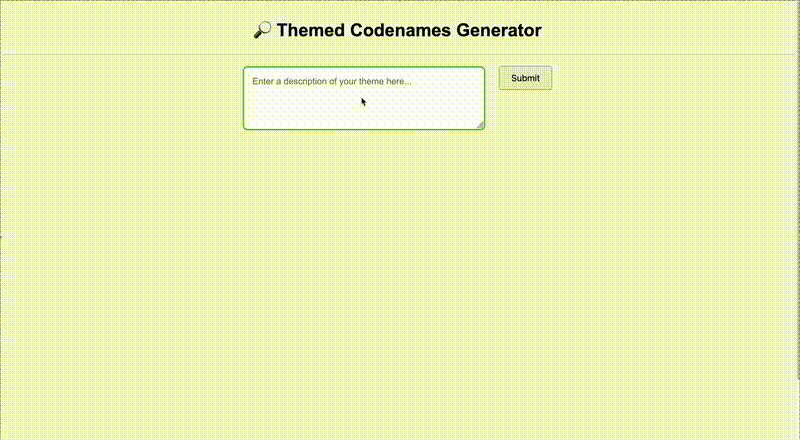

# Themed Codenames

Ever wanted to play the classic Codenames game but with words from any arbitrary theme? This version helps you do exactly that, leveraging modern LLMs via ollama to help generate the words.



> **Notice:** If you find any issues or would like to contribute (especially to a multiplayer version), please open an issue or pull request on GitHub!

## Features

- Enter a custom theme to generate words related to that theme.
- Play as a player or a spymaster with the same set of words.
- Uses local or API-based word generation.

## Setup (for local)

Follow these steps in your command line interface (Terminal on Mac/WSL for Windows):

1. **Clone the repository:**

   ```sh
   git clone https://github.com/saakethmm/Themed-Codenames.git
   cd Themed-Codenames
   ```

2. **Install dependencies using `conda`:**

   ```sh
   conda env create -f environment.yaml
   conda activate themed-codenames
   ```

3. **Install appropriate ollama model**

   ```sh
   ollama pull llama3.2:latest
   ```
   > **Note:** If you wish to use a different model, you must also update the model name on line 66 of `app/word_service.py` to match your chosen model.

4. **Set up environment variables:**

   ```sh
   export FLASK_ENV=development
   ```

5. **Run Flask Application:**

   ```sh
   python run.py
   ```

## Configuration

- `config.py`: Contains configuration classes for development and production environments.
- `DevelopmentConfig`: Uses Ollama for local word generation.

## Usage

1. Access the application at [http://127.0.0.1:5000](http://127.0.0.1:5000)
2. Enter a theme in the input field and click "Submit" to generate words related to that theme.
3. Enjoy the game with your custom Codenames! (edit cards by right clicking if any cards don't fit)

## Testing

Run the unit tests using:

```sh
python -m unittest discover tests
```

## Future Updates

1. Add API call functionality to desired LLM
2. Allow multiplayer across devices, hosted on a website